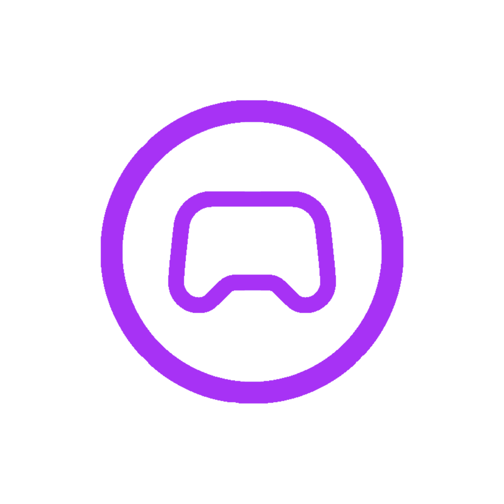

<div align="center">
  <h1 style="display: flex; align-items: center; justify-content: center">
    
    <span style="color: #a732f5">Game</span>&nbsp;Server Status
  </h1>
  <p>A simple app to monitor the status of Minecraft and Steam servers.</p>
</div>
<hr>

# Data protection

This app does not collect personal information. It stores the server address, port and display name on the device. Your IP is shared with whichever server you are adding because your device connects to this server to get the status.

# Developement run

Installation of dependencies

```bash
npm install
```

Start app if you have an emulator or a real device connected and the SDK (Android: adb) installed

```bash
npm run android
# or
npm run ios
```
