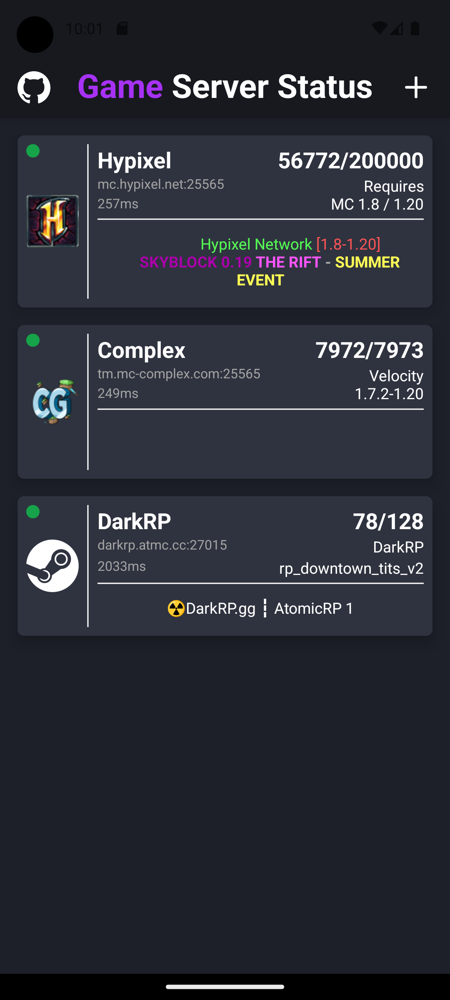

<div align="center">
  <h1>
    
    Game Server Status
  </h1>
  <p>A simple app to monitor the status of Minecraft and Steam servers.</p>
</div>
<hr>

# Data protection / Datenschutzerklärung

This app does not collect personal information. It stores the server address, port and display name on the device. Your IP is shared with whichever server you are adding because your device connects to this server to get the status.

# Usage

- Swipe right on a server to edit it
- Swipe left on a server to delete it
- Press and hold on a server to move it
- Pull down to refresh

# Screenshots

|              Home screen              |              Add sever screen              |
| :-----------------------------------: | :----------------------------------------: |
|  |  |

# Developement run

Installation of dependencies

```bash
npm install
```

## Development Build (recommended)

Create a [development build](https://docs.expo.dev/develop/development-builds/create-a-build/) of the app and install it on your device or emulator.
After that you can run the app with the following command:

```bash
npm run start
```

If you have a device connected and ADB is running, you can start the app by pressing `a` in the terminal.

> [!NOTE]
> This command will start the app via an ngrok tunnel


## Expo Go (does not work with native modules (like the TCP or UDP clients))

```bash
npm run start:go
```

> [!NOTE]
> This command will start the app via an ngrok tunnel

## WSL

If you are using WSL and want to use ADB, you need to set the network mode to "mirrored" in the `.wslconfig` file in your users home directory (on Windows).

```ini
[wsl2]
networkingMode=mirrored
```

You also need the [Android Platform Tools](https://developer.android.com/tools/releases/platform-tools) and start the adb server with the following command from a PowerShell (Admin):

```powershell
adb start-server
```
